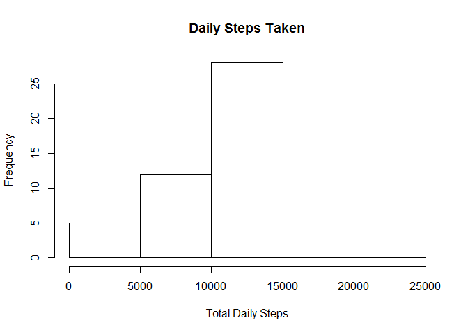
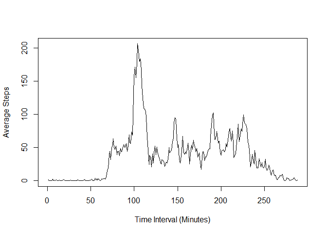
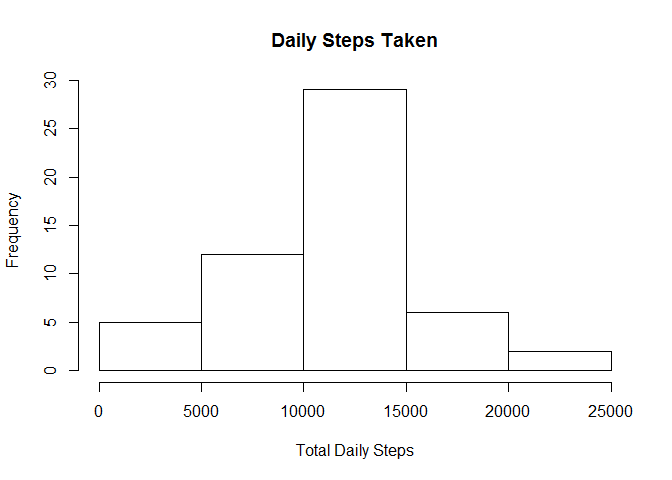
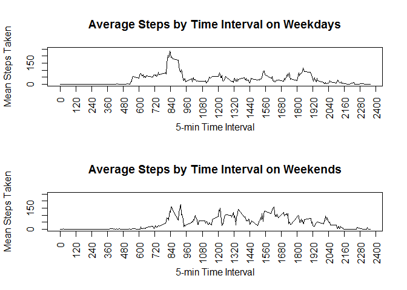

Reading in the Data
-------------------

    activity <- read.csv(file = "activity.csv", header = TRUE)

Histogram of Daily Steps Taken
------------------------------

    daily <- tapply(activity$steps, activity$date, FUN = sum)
    hist(daily, main = "Daily Steps Taken", xlab = "Total Daily Steps")

Mean and Median Steps Taken:
----------------------------

    dailymean <- mean(daily, na.rm = TRUE)
    dailymed <- median(daily, na.rm = TRUE)

The mean number of steps per day is 1.076618910^{4}.  
The median number of steps per day is 10765.

Time Series of Daily Activity
-----------------------------

    timeseries <- tapply(activity$steps, activity$interval, FUN = mean, na.rm = TRUE)
    plot(timeseries, type = "l", ylab = "Average Steps", xlab = "Time Interval (Minutes)")

    maxinterval <- activity$interval[which.max(timeseries)]

On average, the 835 minute time interval contains the maximum number of
steps.

Missing Values
--------------

    missing <- sum(is.na(activity$steps))

There are 2304 NA values in the dataset.

The "NA" values will be replaced with the mean value for their time
interval.

    fixed <- activity
    toreplace <- which(is.na(activity$steps))
    fixed$steps[toreplace] <- timeseries[which(names(timeseries) == fixed$interval[toreplace])]

Replicating the earlier calculations on the "fixed" dataset:

    daily2 <- tapply(fixed$steps, fixed$date, FUN = sum)
    hist(daily2, main = "Daily Steps Taken", xlab = "Total Daily Steps")

    dailymean2 <- mean(daily2, na.rm = TRUE)
    dailymed2 <- median(daily2, na.rm = TRUE)

The mean number of steps per day was 1.076618910^{4} and is now
1.076618910^{4}.  
The median number of steps per day was 10765 and is now
1.076559410^{4}.  
Adding mean values to replace NAs did not affect the overall averages.

Comparing Weekdays and Weekends
-------------------------------

Add new factor column indicating weekdays or weekends, then take
averages and plot

    fixed$weekday <- ifelse(weekdays(as.Date(fixed$date)) %in% c("Saturday", "Sunday"), "weekend", "weekday")

    averages <- as.data.frame(tapply(fixed$steps, list(fixed$interval, fixed$weekday), FUN = mean, na.rm = TRUE))

    library(data.table)
    setDT(averages, keep.rownames = TRUE)[]

    ##        rn   weekday   weekend
    ##   1:    0 2.3179245  0.000000
    ##   2:    5 0.4584906  0.000000
    ##   3:   10 0.1783019  0.000000
    ##   4:   15 0.2037736  0.000000
    ##   5:   20 0.1018868  0.000000
    ##  ---                         
    ## 284: 2335 1.9424528 12.571429
    ## 285: 2340 2.1075472  6.714286
    ## 286: 2345 0.2160377  1.857143
    ## 287: 2350 0.3056604  0.000000
    ## 288: 2355 1.4518868  0.000000

    names(averages)[1] <- "interval"

    par(mfrow = c(2,1))
    with(averages, plot(interval, weekday, main = "Average Steps by Time Interval on Weekdays", type = "l", xlab = "5-min Time Interval", ylab = "Mean Steps Taken", ylim = c(0,250), xaxt = "n"))
    axis(1, xaxp = c(0,2400, 20), las = 2)
    with(averages, plot(interval, weekend, main = "Average Steps by Time Interval on Weekends", type = "l", xlab = "5-min Time Interval", ylab = "Mean Steps Taken", ylim = c(0,250), xaxt = "n"))
    axis(1, xaxp = c(0,2400, 20), las = 2)

